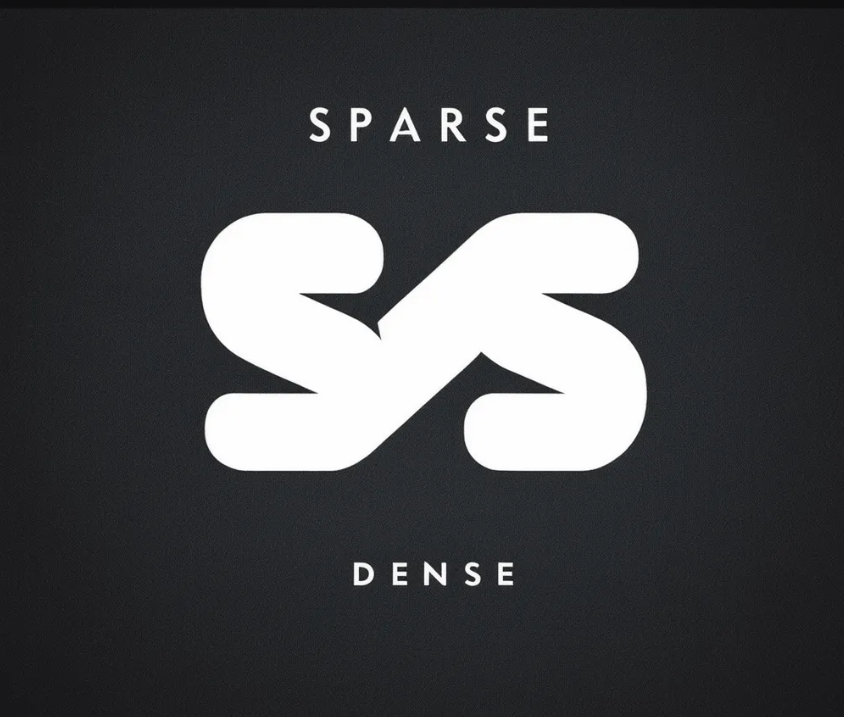
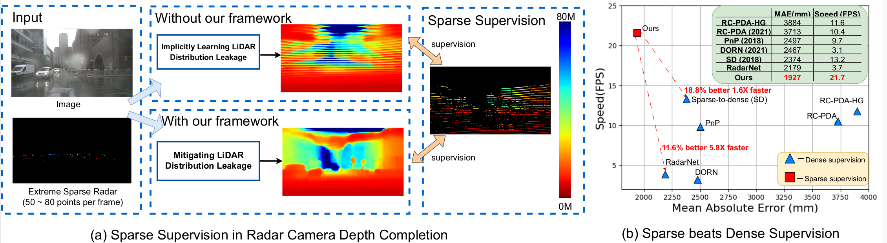

<div  align=center></div>


## <p align=center>[ECCV 2024] Sparse Beats Dense: Rethinking Supervision in Radar-Camera Depth Completion</p>

<p align=center>Huadong Li<sup>*</sup>, Minhao Jing<sup>*</sup>, Jing Wang, Shichao Dong, Jiajun Liang, Haoqiang Fan, Renhe Ji<sup>‡</sup> </p>

**<p align=center>MEGVII Technology</p>**

  <p align=center><sup>*</sup>Equal contribution  <sup>†</sup>Lead this project <sup>‡</sup>Corresponding author</p>


  <div align="center">
  <br>
  <a href='https://arxiv.org/abs/2312.00844'></a>
  <!-- <a href='https://megactor.github.io/'></a>
  <a href='https://f4c5-58-240-80-18.ngrok-free.app/'>.svg'></a>
  <a href='https://openbayes.com/console/public/tutorials/3IphFlojVlO'></a> -->
  <br>
</div>


## Overview

  

It is widely believed that sparse supervision is worse than dense supervision in the field of depth completion, but the underlying reasons for this are rarely discussed.
To this end, we revisit the task of radar-camera depth completion and present a new method with **sparse LiDAR** supervision to outperform previous **dense LiDAR** supervision methods in both accuracy and speed.

Specifically, when trained by sparse LiDAR supervision, depth completion models usually output depth maps containing significant stripe-like artifacts.
We find that such a phenomenon is caused by the implicitly learned positional distribution pattern from sparse LiDAR supervision, termed as **LiDAR Distribution Leakage (LDL)** in this paper.
Based on such understanding, we present a novel **Disruption-Compensation** radar-camera depth completion framework to address this issue.
The **Disruption** part aims to deliberately disrupt the learning of LiDAR distribution from sparse supervision, while the **Compensation** part aims to leverage 3D spatial and 2D semantic information to compensate for the information loss of previous disruptions.

<!-- By reducing the LDL, we first present the depth completion model trained by sparse supervision. -->
<!-- 
Extensive experimental results demonstrate that by reducing the impact of LDL, our framework with **sparse supervision** outperforms the state-of-the-art **dense supervision** methods with **11.6%** improvement in Mean Absolute Error (MAE) and **1.6** speedup in Frame Per Second (FPS). -->


## Preparation

* Environment

   * Detailed environment settings should be found with requirements.txt

```
pip3 install -r requirements.txt
```

* Dataset
   * Download the segmentaion masks files at [Google Drive](https://drive.google.com/drive/folders/1t6x9UEzbxejbac0dFT1CQSoVhzeEhIC4?usp=drive_link). 
   * Please visit the [Official Nuscenes Website](https://www.nuscenes.org/nuscenes) to download the dataset.
   
```
-  data
  - nuscenes_radar_5sweeps_infos_test.pkl
  - nuscenes_radar_5sweeps_infos_train.pkl
  - nuscenes_radar_5sweeps_infos_val.pkl
  - nuscenes
     - samples
     - seg_mask.tar

cd data/nuceneses
tar xvf seg_mask.tar
```

* Pretrained weights

   * Please Download our pretrained weights on [Google Drive](https://drive.google.com/drive/folders/1JgwLZ2ALgpJ9OSgpRBuKjAOvUVTRUo-q?usp=sharing).

```
mkdir checkpoints & cd checkpoints
mv model.ckpt ./chekpoints/model.ckpt
```

## Training
 
```
OMP_NUM_THREADS=4 torchrun --nproc_per_node ${GPU Nums} train_DDP.py
```


## Eval

```
python3 eval.py -m ./checkpoints/model.ckpt
```


## BibTeX
```
@misc{li2023sparsebeatsdenserethinking,
      title={Sparse Beats Dense: Rethinking Supervision in Radar-Camera Depth Completion}, 
      author={Huadong Li and Minhao Jing and Jiajun Liang and Haoqiang Fan and Renhe Ji},
      year={2023},
      eprint={2312.00844},
      archivePrefix={arXiv},
      primaryClass={cs.CV},
      url={https://arxiv.org/abs/2312.00844}, 
}
```

## Contact
If you have any questions, feel free to open an issue or contact us at lihuadong@megvii.com or jirenhe@megvii.com.
